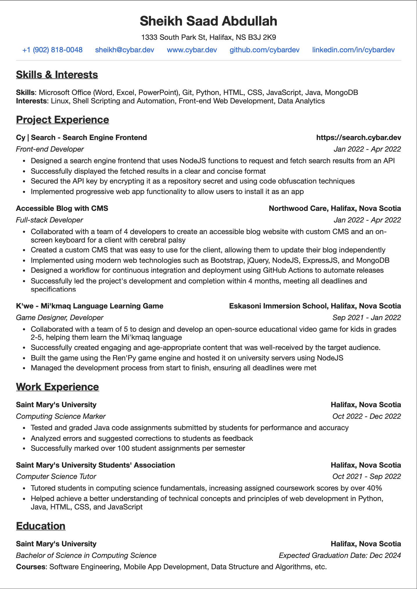

# Resume

## Generate resume using data representation objects in Python

### Dependencies

-   `python >= 3.9`
-   `pandoc`
-   `wkhtmltopdf`
-   `poppler-utils`

### Installation

-   clone this repo
-   add full path of `src/` directory to `PYTHONPATH`

> **TODO**: publish it on PyPI for easy installation

### Usage

-   create `.py` file
-   import all from `resume.components`:
    ```py
    from resume.components import *
    ```
-   create `author` variable and assign it an `Author` object
-   fill `Author` object parameters with info (see [example.py](example.py))
-   run `resume.builder` following examples below

Output of `python3 -m resume.builder -h`:

```
usage: resume.builder [-h] [-o OUTPUT] [-t HTML] [-c CSS] RESUME

Generate a resume from a given python file

positional arguments:
  RESUME                path to the Python file containing the resume data

options:
  -h, --help            show this help message and exit
  -o OUTPUT, --output OUTPUT
                        path to the output directory
  -t HTML, --template HTML
                        path to the HTML template file
  -c CSS, --css CSS     path to the CSS template file
```

#### Examples

-   see default help message

    ```sh
    python3 -m resume.builder -h
    ```

-   generate resume from `example.py` to current directory

    ```sh
    python3 -m resume.builder example.py
    ```

-   generate resume from `example.py` to `build/` directory

    ```sh
    python3 -m resume.builder example.py -o ./build
    ```

-   generate resume from `example.py` to `build/` directory using custom `html` and `css` templates

    ```sh
    python3 -m resume.builder example.py -o ./build -t custom.html -c custom.css
    ```

### Sample Output

**Source**: [example.py](example.py)


